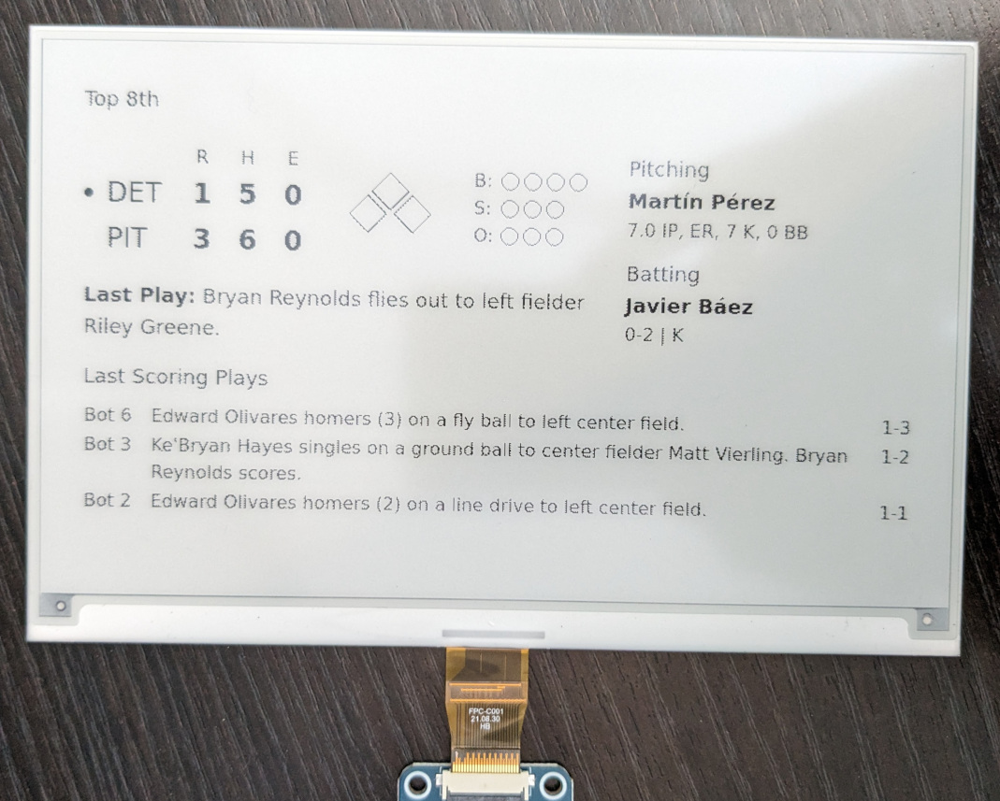

# Major League Paperball



major-league-paperball is an app that allows you to follow your favorite Major League Baseball (MLB) team, including live game updates, on a Waveshare 7.5" e-ink screen. It assumes you're running the app on a Raspberry Pi, but any device capable of running both Node and Python should work.

The app works by running a Node app that uses the [MLB Stats](https://statsapi.mlb.com/docs) to fetch information about a specific team, renders the display image directly using [Satori](https://github.com/vercel/satori) and [resvg-js](https://github.com/yisibl/resvg-js), and finally uses a small Python script to draw the image to the e-ink screen.

## Shopping List

In order to run this app, I suggest buying the 7.5" Waveshare e-ink screen with Raspberry Pi HAT, as well as any Raspberry Pi capable of running Node, Python, and connecting to the internet.

1.  [Waveshare 7.5" e-ink screen](https://www.waveshare.com/7.5inch-e-paper-hat.htm) [[Amazon US](https://www.amazon.com/dp/B075R4QY3L)]
2.  Either: [Raspberry Pi Zero W](https://www.raspberrypi.com/products/raspberry-pi-zero-w/)
3.  OR: [Raspberry Pi 5](https://www.raspberrypi.com/products/raspberry-pi-5/)

## Setup

TL;DR: Setup your Pi, install NodeJS and Python3. Clone the repo, copy `.env.example` to `.env`, adjust the values within, and then keep the app running with pm2.

### Setup Your Raspberry Pi

This is just like setting up any other Raspberry Pi. I recommend using Raspberry Pi OS, but any other OS that works on Pi should work here, but the individual commands that follow might not.

1. Setup Raspberry Pi OS on a micro sdcard. You can use a desktop or server image, depending on what else you want to do with this Pi and how you plan to set it up (SSH or keyboard and monitor directly on the Pi).
2. Run `sudo raspi-config nonint do_spi 0`
3. Reboot

### Setup NodeJS

Install nvm and use it to install Node. You can checkout [nvm's website](https://github.com/nvm-sh/nvm) for the latest release and installation instructions:

```
curl -o- https://raw.githubusercontent.com/nvm-sh/nvm/v0.39.7/install.sh | bash
source ~/.bashrc
nvm install v20.12.1
node -v
npm -v
```

Make sure both `node` and `npm` report a version to ensure they installed.

### Setup Python

Ensure python3 is installed:

```
python3 --version
```

If it's not:

```
sudo apt install python3
```

### Setup Misc Dependencies

You'll want `git` to clone this repository. Alternately, you can download the source code from GitHub and unpack it on your Pi.

```
sudo apt install -y git
```

### Running the App

Clone the repository, setup a python virtual environment, and install node and python dependencies:

```
git clone https://github.com/mrkrstphr/major-league-paperball.git
cd major-league-paperball
npm install
python3 -m venv --system-site-packages .venv
.venv/bin/pip3 install -r requirements.txt
```

Copy the example environment file. Edit the file and follow the directions in it for setting a handful of variables:

```
cp .env.example .env
```

Now you should be all set to run the app. Since the app is a NodeJS app (that calls a python script to update the screen), you can use any method of running a NodeJS app. I suggest using PM2, which is a process manager that will keep the app running across crashes (sorry) and reboots.

```
npm install -g pm2
pm2 startup
pm2 start "npm start" --name "paperball"
pm2 save
```

The app should now be running and hopefully after a few seconds, your screen will be updated.

If it doesn't appear to be working, you can run `pm2 status` to verify that its running and `pm2 logs` to see any log information that might help understand what went wrong.

## How it Works

The app is primarily a Node app that periodically fetches information from the MLB Stats API. I chose Node because I know JavaScript best, and being a busy dad with a full time job and part time laziness. Honestly, I should just learn how to make a Python web-app and have it be an all Python app.

The code aims to be a good steward of the MLB Stats API as well as the e-ink screen, which means it both fetches data as little as possible and tries not to unnecessarily write to the screen (because of the ugly flicker when updating the screen).

When no game is active, the screen fetches data, by default, every 20 minutes. When a game is active, it's every 20 seconds. If the data fetched is the same as last time, it doesn't bother refreshing the screen.

If there is new data, the app renders a PNG directly in-process using [Satori](https://github.com/vercel/satori) (JSX → SVG) and [resvg-js](https://github.com/yisibl/resvg-js) (SVG → PNG) — no headless browser required. It then uses a Python script (since the native code provided by Waveshare is either Python or C) to send the image to the screen.

### States

The app has several display states:

1.  **Offline**: Initial state before the first fetch completes.
2.  **Missing Team**: Shown when `TEAM_ID` is not configured; displays a list of teams to choose from.
3.  **Standings**: No game today or soon; shows division standings along with previous and upcoming game details.
4.  **Preview**: A game is starting soon; shows the upcoming matchup.
5.  **Live Game**: Game in progress; shows score, current inning, count, base runners, last play, and last 3 scoring plays.
6.  **End of Inning**: Shown between half-innings during a live game.
7.  **End of Game**: Shows the final score for approximately 20 minutes after the game ends.
